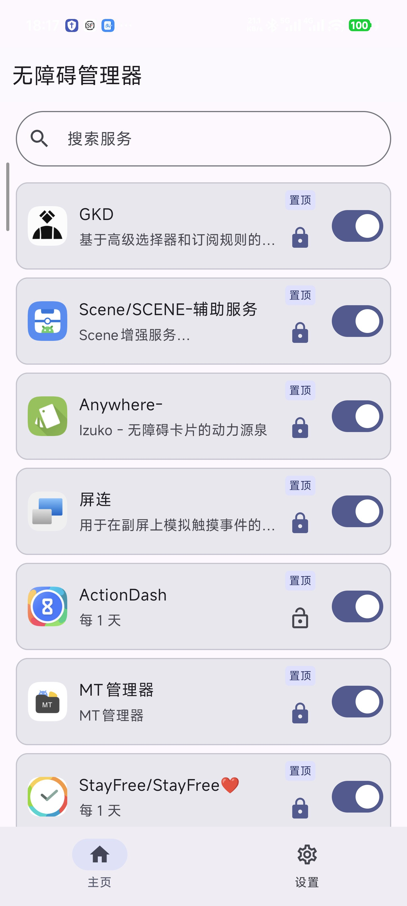
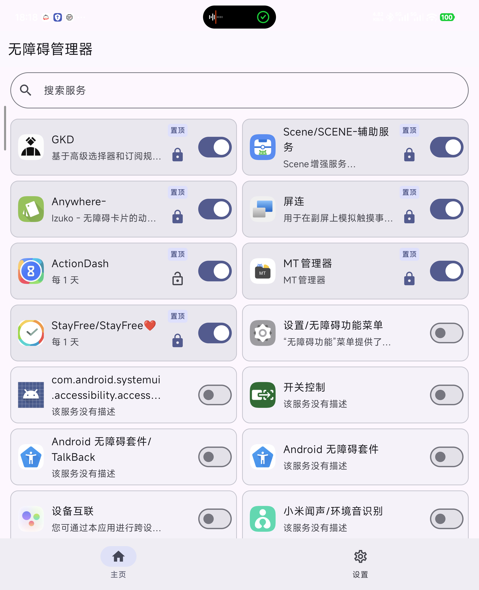

# 无障碍管理器（MD3 重构版）

本 APP 可以彻底取代系统设置里的无障碍设置页面。仅需授权本 APP 写入安全设置即可使用。保活为事件驱动守护（无轮询、无定时唤醒），且保活速度极快；可选的定期重启功能默认关闭，开启后按需调度。

## 本分支：MD3 重构版 1.2

界面已全面改用 **Jetpack Compose** 重写（此前为 View + XML），并按「MD3 骨架 」设计规范落地整套设计系统。

- **命名主题 4 个**：品牌 / 中性 / 单色 / 跟随壁纸 —— 配色由算法从源色生成，可自由切换
- **对比度 4 档**：降低 / 默认 / 较高 / 最高
- 手机 / 平板自适应网格（1–3 列，宽度驱动），卡片统一 88dp 等高
- 服务搜索
- 每服务定期自动重启（WorkManager，仅灭屏执行，不耗电）
- 详情弹卡：服务能力 / 事件解析 + 周期设置
- 最低系统：**Android 7.0**

完整变更见 [1.2 发布说明](.codebuddy/release-notes-v1.2.md)。

## 截图

| 手机 | 平板 |
|---|---|
|  |  |

## 使用

1. 安装 APK（见 Releases）
2. 授权写入安全设置（三选一）：

   ```bash
   adb shell pm grant com.accessibilitymanager android.permission.WRITE_SECURE_SETTINGS
   ```

   或 root 执行同命令，或通过 Shizuku 授权

3. 正常使用
